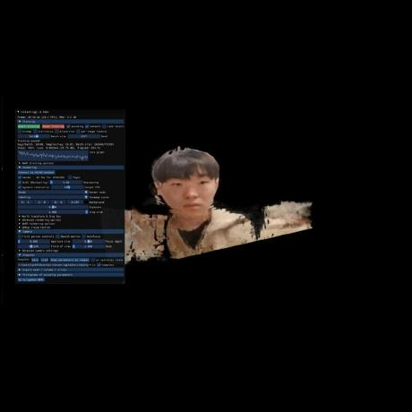

## 🗃️ Project Repository
[Repository](https://github.com/CAU-DesignPattern-2024/rabbit-escape)  
Github Issue 17개  
Pull Requests 21개
Commit 144개

## 📌 Project Result
1. Frame 클래스에 Builder 패턴 적용
2. Cache 클래스에 Proxy 패턴 적용
3. Solution 클래스에 Composite 패턴 적용
4. Token 클래스에 Decorator 패턴 적용
5. World 이벤트 관리에 Adapter, Observer 패턴 적용
6. GithubIssue 클래스에 State 패턴 적용
7. Bridging 토끼 이동에 Strategy 패턴 적용
8. Visitor 패턴을 활용한 로깅 기능 도입
9. Walking 클래스에 Chain of Responsibility 패턴 적용
10. WorldChanges 클래스에 Command 패턴 적용

## 🐥 Team
| [유용민](https://github.com/yymin1022) | [채승운](https://github.com/win-luck) | [조도연](https://github.com/ysndy) | [고하영](https://github.com/hayeongKo) | [이지수](https://github.com/devJS00) |
| --- | --- | --- | --- | --- |
|  |  |  |  |  |
| 소프트웨어학부 "19 | 소프트웨어학부 "19 | 소프트웨어학부 "20 | 소프트웨어학부 "21 | 소프트웨어학부 "21 |
